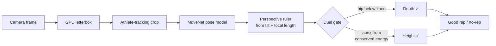

# Tiago Dias

I build voice AI agents, on-device computer vision, and iOS apps. Mostly solo, mostly end to end.

Most of what I ship lives in private repos, so this page links to the things you can actually open and use.

<picture>
  <source media="(prefers-color-scheme: dark)" srcset="https://raw.githubusercontent.com/lordofclaude/lordofclaude/output/github-contribution-grid-snake-dark.svg" />
  <source media="(prefers-color-scheme: light)" srcset="https://raw.githubusercontent.com/lordofclaude/lordofclaude/output/github-contribution-grid-snake.svg" />
  
</picture>

## Shipped

**[Hirefly](https://hirefly.io)** — recruiting platform where an AI agent phones candidates, runs a structured screening call, and scores it. Twilio and ElevenLabs behind a consent-first flow, plus an audio-analysis pipeline (Praat, openSMILE) that derives a communication score from the real call instead of a self-assessment. Designed to stay on the right side of the EU AI Act: no inferred emotion or personality, only measurable speech properties.

**WallBall Coach** — iOS app that judges wall-ball reps from the camera, entirely on the phone. MoveNet pose detection inside a VisionCamera frame worklet, an athlete-tracking crop so a gym-framed athlete is more than 50 pixels tall in the model input, and a perspective-corrected ruler that solves the lens distance and height from the phone's own tilt and focal length. That last part matters: a phone tilted up compresses everything above your head, which made correct 2.4 m throws read as 2.0 m. Currently on TestFlight.

**[Cordial call bridge](https://hermes-cordial-bridge.lordofclaude.workers.dev)** — Cloudflare Worker I built for a partner's missed-call product. It answers the phone through an ElevenLabs agent, scores the lead from the transcript, and sends the business a Telegram summary with tap-to-book calendar slots. Multi-tenant onboarding by SMS one-time code, so anyone can forward their own number to it.

**[Station Nine](https://station-nine.expo.app)** — HYROX training app with a coaching engine that adapts to logged sessions, and a camera-based wall-ball trainer.

**[Connect Hub](https://nexus-connecthub.vercel.app)** — personal CRM for your network: track conversations, activities, and who you owe a reply.

## Open source

- **[Hi-Lo Royale](https://github.com/lordofclaude/hilo-royale)** — prediction battle royale on real World Cup data. One fan, 99 simulated rivals, one match, with verifiable TxODDS and ORAO receipts on Solana. Built at the TxODDS World Cup hackathon. [Live](https://hilo-royale.vercel.app).
- **[Foresight](https://github.com/lordofclaude/foresight)** — verified prediction reputation on TxLINE and Solana, so a forecaster's record is provable rather than claimed. [Live](https://foresight-txline.vercel.app).
- **[Operator Prompts](https://github.com/lordofclaude/operator-prompts)** — free AI prompts written for specific professions rather than for prompt engineers.
- **[Operator Programs](https://github.com/lordofclaude/operator-programs-site)** — ten practical AI programs, each written for one profession and screen-recorded on real work rather than toy examples. [Live](https://ai-courses-beta.vercel.app).

## How I work

TypeScript and Expo/React Native for products, Python for analysis and data pipelines, Cloudflare Workers and Supabase for backends.

I put the test effort where being wrong is expensive. The wall-ball judge is the clearest example: instead of building to TestFlight to find out whether it counts correctly, it replays a recorded video through the exact shipped pipeline offline, and grades the result against a ground truth derived from the ball's hang time, which is pure physics and needs no camera calibration at all. That turned a two-hour round trip per hypothesis into a two-minute one, and it immediately found that the shipped judge was detecting none of the 31 throws in a real clip.

## Elsewhere

- Email: tiagobrbdias@gmail.com
